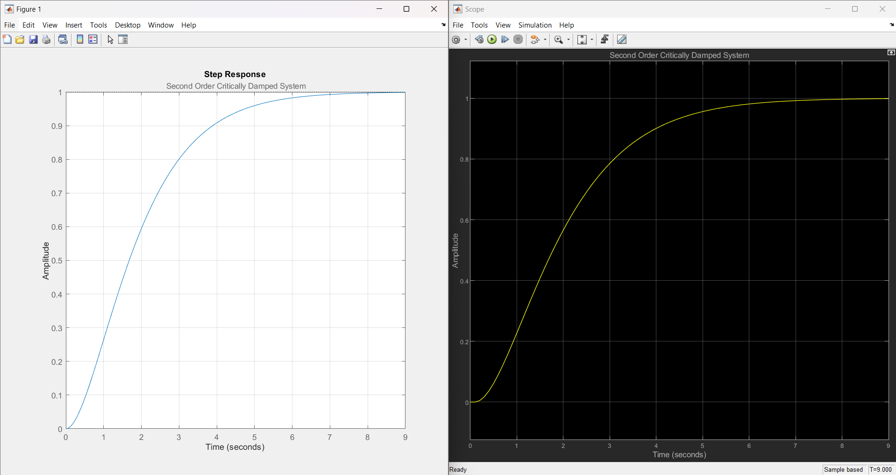
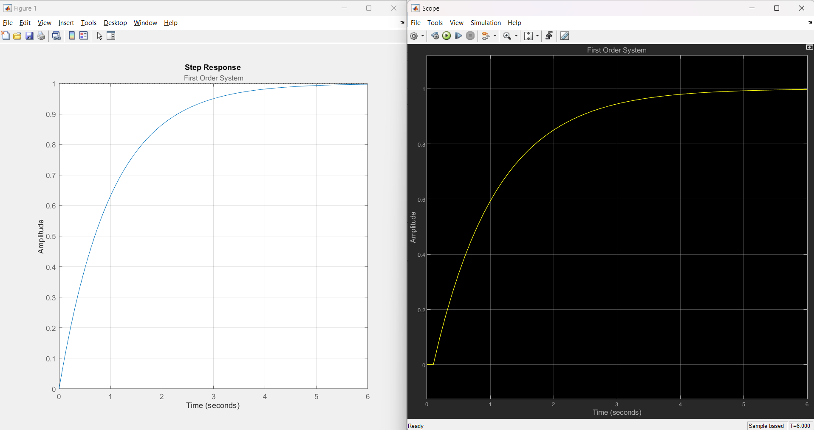

# Step Response (Group 4 - Laboratory Activity 2)

### 3. Second Order Critically Damped System
  - Represents a critically damped system.
$$G(s) = \frac{1}{(s+1)^2}$$
 

 

### 4. First Order System
- Represents a First Order System
$$G(s) = \frac{1}{(s+1)}$$
 

 

### 5. Resonant System 
- Modeling a resonant system with a sharp peak.
$$G(s) = \frac{8s^6 + 7s^5 + 6s^4 + 5s^3 + 4s^2 + 3s + 2}{s^7 + 2s^6 +3s^5 + 4s^4 + 5s^3 + 6s^2 + 7s + 1}$$
 

 

### 6. Electrical Filter with Multiple Poles
- Modeling an electrical filter with multiple poles.
$$G(s) = \frac{4s^3 + 3s^2 + 2s +1}{s^4 + 2s^3 + 4s +1}$$
 

 

### 7. Plant with Time Delay
- Modeling a system with time delay.
$$G(s) = \frac{6s^4 + 5s^3 + 4s^2 + 3s + 2}{s^5 + 2s^4 + 3s^3 + 4s^2 + 5s + 1}$$
 

 

### 8. Nonlinear System Approximation
- Modeling a nonlinear system with a polynomial approximation.
$$G(s) = \frac{10s^4 + 8s^3 + 6s^2 + 4s + 2}{s^5 + 3s^4 + 5s^3 + 7s^2 + 9s + 1}$$
 

